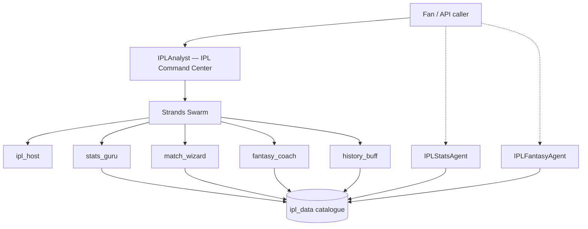

# IPL Multi-Agent Command Center

An [Amazon Bedrock AgentCore](https://aws.amazon.com/bedrock/agentcore/) project that turns cricket fandom into a **multi-agent AI experience** for the Indian Premier League (IPL).

## Architecture



**IPLAnalyst** is the main entry point: a five-agent swarm that collaborates on stats, match analysis, fantasy tips, and IPL history. **IPLStatsAgent** and **IPLFantasyAgent** are deployable specialist runtimes you can call directly.

## Agents

| Runtime | Pattern | What it does |
| --- | --- | --- |
| `IPLAnalyst` | Strands Swarm (5 agents) | Full IPL assistant — routes to specialists automatically |
| `IPLStatsAgent` | Single specialist | Deep-dive stats, standings, player comparisons |
| `IPLFantasyAgent` | Single specialist | Dream11 XI, captain picks, fantasy ratings |

## Quick start

```bash
# Run the main swarm locally
agentcore dev

# Example prompts (new terminal)
agentcore invoke --dev "Orange Cap race in IPL 2024 — who won and by how much?"
agentcore invoke --dev "KKR vs SRH head to head and 2024 final recap"
agentcore invoke --dev "I'm an RCB fan — cheer me up with some Kohli stats"
```

Deploy to AWS:

```bash
agentcore validate
agentcore deploy
agentcore invoke "Build a premium fantasy XI for MI vs CSK"
```

## Memories

Each agent has AgentCore Memory configured in `agentcore/agentcore.json`:

- **IPLAnalyst** — fan preferences (favorite team) + semantic recall of past analysis
- **IPLStatsAgent** — semantic recall of stats lookups
- **IPLFantasyAgent** — fantasy league preferences (risk style, platform)

## Project layout

```
app/
├── IPLAnalyst/          # Swarm orchestrator + full tool suite
│   ├── agents/          # Swarm team definition
│   ├── ipl_data/        # Curated IPL 2024 data
│   └── tools/           # Stats, match, fantasy, history tools
├── IPLStatsAgent/       # Standalone stats agent
└── IPLFantasyAgent/     # Standalone fantasy agent
agentcore/
└── agentcore.json       # Three runtimes + three memories
```

## Sample questions

- *"Compare Bumrah and Harshal Patel as bowlers in 2024"*
- *"What happened in the 2024 IPL final?"*
- *"Rate Sunil Narine as a fantasy pick"*
- *"Which team has won the most IPL titles?"*
- *"Predict MI vs CSK at Wankhede"*

Built with **Strands Agents** on **AgentCore Runtime** — no external cricket API required; knowledge is embedded in `ipl_data/catalogue.py`.
